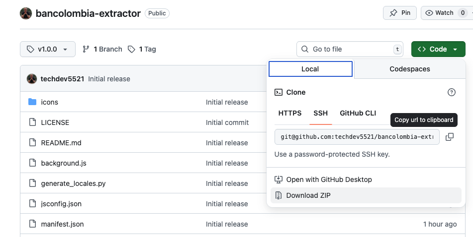
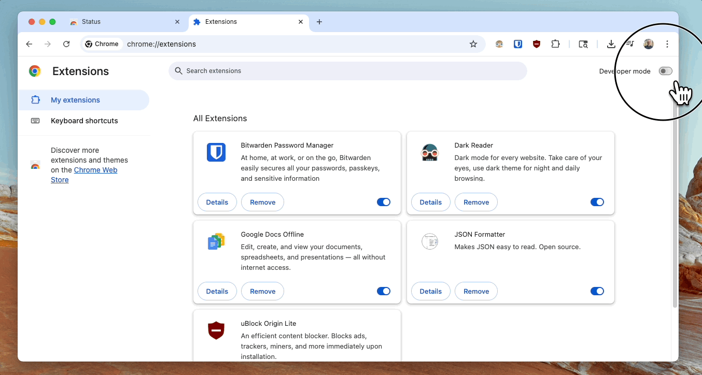
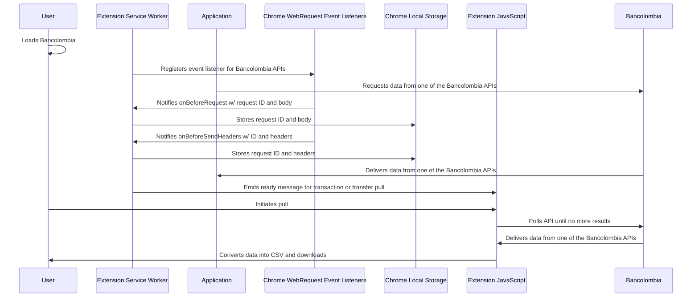

# Bancolombia Extractor
A Chrome extension to download transaction data from Bancolombia as CSV files for use in external systems for money management.

- [Install](#install)
- [Usage](#usage)
- [Privacy Notice](#privacy-notice)
- [Lifecycle of Request](#lifecycle-of-request)
- [Translations](#translations)
  - [Adding Translations](#adding-translations)
  - [Generating Translations](#generating-translations)
  - [Using Translations](#using-translations)
    - [Using Translations in `popup.html`](#using-translations-in-popuphtml)
    - [Using Translation via the Chrome i18n API](#using-translation-via-the-chrome-i18n-api)

## Install
- Download the ZIP archive of this repo using the green Code button above.

- Extract the ZIP file once it is downloaded.
- In Google Chrome, go to [chrome://extensions](chrome://extensions) and enable Developer Mode.
- Select "Load Unpacked Extension" and select the folder that was extracted from the ZIP file.
- (Optional) Open the extension menu in the top left and pin the extension for easy access.
- You're ready to use the extension.



## Usage
- Sign into Bancolombia (the extension will prompt you to do so if you're not already)
- Navigate to the account you want to download data for
- To download transfer data, select the "Movimientos" tab and open the extension
- To download transaction data, select "Historials de Transacciones" and open the extension

## Privacy Notice
This extension does not store or transmit any data dealing with your account. It works by listening for network requests made by the Bancolombia webpage to retrieve your data and copying the authentication information into memory while it makes subsequent requests to get all data. This request data is temporarily stored in the extension local storage and can be reviewed by:

- Opening the extension popup, right clicking in the popup and selecting "Inspect" to open the extension's developer tools.
- Selecting the Application tab and reviewing the extension local storage values.


## Lifecycle of Request


## Translations
For translations, this extension uses [Chrome's i18n API](https://developer.chrome.com/docs/extensions/reference/api/i18n). However, in place of the [i18n API's suggested folder structure](https://developer.chrome.com/docs/extensions/reference/api/i18n#support_multiple_languages) which requires several folders and files, translations for this project are stored in the `translations.json` file and get transformed into the necessary folder structure by the `generate_locales.py` script.

### Adding Translations
To add a translation, add it to the `translation.json` file. This file contains a JSON object with keys corresponding to an ID that can be used to lookup the message from the UI. The value of those keys are another object that has keys corresponding to the [i18n API's supported locales](https://developer.chrome.com/docs/extensions/reference/api/i18n#locales) with values of the translated message.

For example, to add a message with ID of "errorMessage" in both English (locale code `en`) and Spanish (locale code `es`):

```json
{
    "errorMessage": {
        "en": "Something went wrong.",
        "es": "Algo salió mal."
    }
}
```

### Generating Translations
After translations have been added, they must be generated for use in the extension. This can be done with the `generate_locales.py` script like this:

```bash
# Command
python3 generate_locales.py

# Output
Transforming locales

Writing locale file '_locales/en/messages.json'
Writing locale file '_locales/es/messages.json'

Finished transforming locales
```

### Using Translations
After generation, translations can be used directly in the `popup.html` file or via the i18n API in JavaScript.

#### Using Translations in `popup.html`
To use a translation in `popup.html`, add a `data-i18n-id` attribute to any element that can contain text and the value of that message ID will be inserted automaically.

```html
<p data-i18n-id="errorMessage"></p>
<!-- 
 Becomes: 
 <p data-i18n-id="errorMessage">Something went wrong!</p> 
-->
```

#### Using Translation via the Chrome i18n API
The automatic insertion of messages based on their ID is achieved by querying elements with the `data-i18n-id` attribute and setting their text to the result of `chrome.i18n.getMessage(element.dataset.i18nId)`:

```js
document.querySelectorAll("[data-i18n-id]").forEach( element => { 
    element.textContent = chrome.i18n.getMessage(element.dataset.i18nId)
})
```
